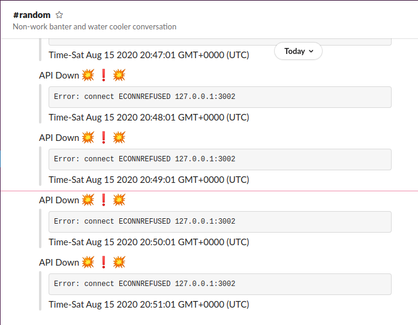

## Api-Status Checker Slack BOT

This is a small configurable bot that checks URL-x for status at every x-minutes for any x-channel on your slack workspace.

> You might end up modifying your API to have a separate /api/status GET route (check ./server.js)

### How to setup :construction_worker:

- Create a Slack App
- Create appropriate scope for the app(chats:read,chats:join)
- Get the token xoxb..
- Add the app to your workspace
- /invite the app to your channel

### How to run :runner: :whale:

#### Build the image

```
docker image build -t <your-tag> .
```

#### Run the container

```
docker run -d -e URL=<YOUR_URL> -e SLACK_TOKEN=<YOUR_SLACK_TOKEN> -e MINUTE=<MINUTE_VALUE> -e CHANNEL=<CHANNEL_NAME> <IMAGE_NAME>
```

#### How to test

- Once everything is setup,you will get the error posted to your channel.

- In case you want to test, grab the id of your container and go inside it

```
docker exec -it <container-id> sh
```

- run the server (at localhost:3001) and set the URL in the container as localhost:3001

```
npm run dev
```

### Screenshot

<p></p>
